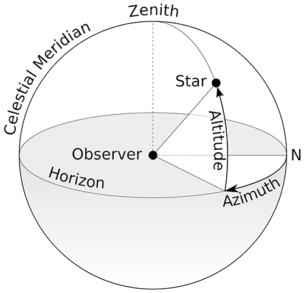

# Sun Calculator

This code calculates the position of the sun at a given date and location.



* The altitude is in radians, where 0 is on the horizon and + is above horizon, - is below horizon.
* The azimuth is in radians, where 0 is south, pi/2 is west, -pi/2 is east, and pi is north.

### Sun Calculator can be used as a script or as a library:

Script example:

```
    python3 sun_calculator.py
```

Library example:

```python
    calculator = SunCalculator()
    date = input("Enter date and time (in format: 2025-02-11 11:25:18): ") # "2025-02-11 11:25:18"
    latitude = input("Enter latitude: ") # 51.21131496342009 = Brugge
    longitude = input("Enter longitude: ") # 3.2258847770102235 = Brugge
    output = calculator.get_position(dt.datetime.strptime(date, "%Y-%m-%d %H:%M:%S"), float(latitude), float(longitude))
    print("On {0}, at latitude: {1} and logitude: {2}, the sun is at\n a) azimuth: {3} \n b) altitude: {4}".format(date, latitude, longitude,output["azimuth"], output["altitude"]))
```